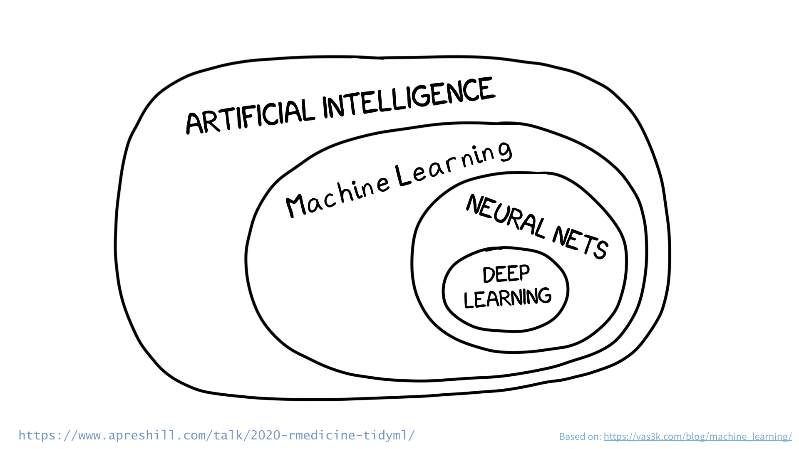
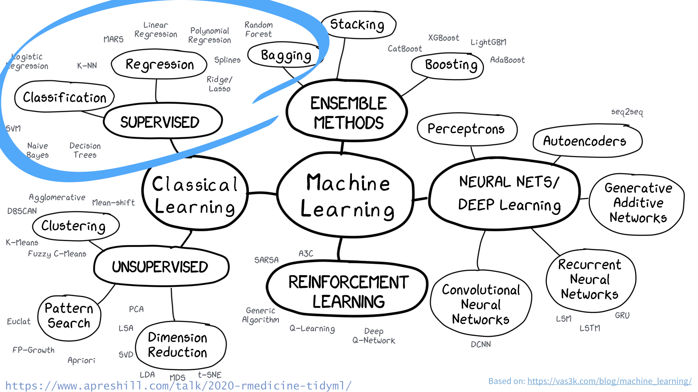
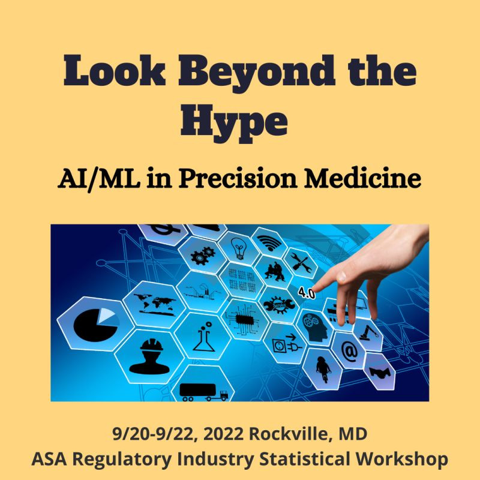

```{r setup, warning=FALSE}
library(tidymodels)
library(tidyverse)
```


```{r, include=FALSE}
rmarkdown::output_metadata$set(
  rsc_output_files = list.files("images", recursive = TRUE, full.names = TRUE)
)
```

class: subtitle-slide, white, middle, center

# Interest in machine learning (ML) in pharma has increased rapidly over the last 10 years. This talk is for those new to ML in pharma.  cost of pharmaceutical R&D was doubling every decade A new drug typically takes more than a decade to develop, at a cost of almost $3 billion  drugmakers and investors are spending billions of dollars to turbocharge the search for new treatments using artificial intelligence
---


class: panel-narrow-slide, center
# AI/ML/DL?



---


class: subtitle-slide, white, middle, left

# I covered python & DL at Phuse 2020:

- https://github.com/philbowsher/Workshop-R-Tensorflow-Scientific-Computing
- https://colorado.rstudio.com/rsc/WorkshopRDeepLearningSci/workshopTensorflow.html#1
---


class: panel-narrow-slide, center
# ML?



---


class: panel-narrow-slide, left

# FDA & ML

- **ML had a big focus at the 2021 FDA Science Forum**
- [2021 FDA Science Forum](https://www.fda.gov/media/149502/download)
- [AI/ML-Based Software as a Medical Device Action Plan](https://www.fda.gov/news-events/press-announcements/fda-releases-artificial-intelligencemachine-learning-action-plan)
- [Pharmacometrics & Neural Networks](https://www.fda.gov/drugs/regulatory-science-research-and-education/new-approach-pharmacometrics-recurrent-neural-networks-modeling-drug-exposure-and-drug-response)
- (ML/DL) methods have been increasingly used across many stages of the drug development process
- E.g. drug discovery, digital imaging, disease diagnostics, genetic testing, adverse event detection, trial recruitment, real-world data & drug repurposing etc.
---


class: panel-narrow-slide, center
# FDA ASA Talk



---


class: panel-narrow-slide, left

# Companies
- [Recursion Pharmaceuticals](https://www.forbes.com/sites/calumchace/2022/02/25/first-wholly-ai-developed-drug-enters-phase-1-trials/?sh=35c6ef752680)
- [Pfizer](https://www.fiercebiotech.com/medtech/pfizer-re-ups-cytoreason-collab-applying-ai-disease-models-to-drug-development)
- [Novartis](https://www.sciencedirect.com/science/article/pii/S2666389921001550)
---


class: panel-narrow-slide, left

# ML Pharma Companies with AI/ML/DL on site
- [insilico](https://insilico.com/)
- [recursion](https://www.recursion.com/)
- [insitro](https://insitro.com/)
- [atomwise](https://www.atomwise.com/)
- [abcellera](https://www.abcellera.com/)
- [deepcure](https://deepcure.ai/)
- [benevolent](https://www.benevolent.com/)
---


class: panel-narrow-slide, left

# Big Tech

- [Google](https://cloud.google.com/solutions/healthcare-life-sciences/drug-development)
- [Google Isomorphic Laboratories](https://www.isomorphiclabs.com/)
- [Deepmind predicts protein structures using just the primary protein sequence](https://cloud.google.com/blog/products/ai-machine-learning/running-alphafold-on-vertexai)
- [Nvidia](https://www.nvidia.com/en-us/industries/healthcare-life-sciences/drug-discovery/)
- [Microsoft](https://news.microsoft.com/transform/novartis-empowers-scientists-ai-speed-discovery-development-breakthrough-medicines/)
- [Facebook](https://ai.facebook.com/blog/ai-predicts-effective-drug-combinations-to-fight-complex-diseases-faster/)
- [Amazon](https://aionlabs.com/)
---


class: subtitle-slide, white, middle, center

# Goal:

Build models that generate accurate predictions for future, 
yet-to-be-seen data.

*Max Kuhn (caret) & Kjell Johnston, http://www.feat.engineering/
---


class: subtitle-slide, white, middle, center

# The tidy modeling "verse" is a collection of packages for modeling & statistical analysis that share the underlying design philosophy, grammar, and data structures of the tidyverse. The following is an intro to this space!

https://r4ds.had.co.nz/explore-intro.html
---


class: panel-narrow-slide, left

# CORE TIDYMODELS PACKAGES
- tidymodels
- rsample
- parsnip
- recipes
- workflows
- yardstick
- tune
- broom
---


class: panel-narrow-slide, left

# Setup & Use
- Install many of the packages in the tidymodels ecosystem by running: install.packages("tidymodels")
- Run library(tidymodels) to load the core packages and make them available in your current R session.
- [Validation](https://www.rstudio.com/assets/img/validation-tidy.pdf)
---


class: panel-narrow-slide, middle, frame


# .center[To specify a model with parsnip]

.right-column[

1\. Pick a .display[model] + .display[engine]

2\. Set the .display[mode] (if needed)

]
---


class: panel-narrow-slide, middle, frame

# .center[To specify a model with parsnip]


```{r}
logistic_reg(engine = "glm") %>%
  set_mode("classification")
```

---

class: panel-narrow-slide, middle, frame

# .center[To specify a model with parsnip]


```{r}
decision_tree(engine = "C5.0") %>%
  set_mode("classification")
```


---
class: panel-narrow-slide, middle, frame

# .center[To specify a model with parsnip]


```{r}
nearest_neighbor(engine = "kknn") %>%              
  set_mode("classification")        
```


---


class: subtitle-slide, white, middle, left

# Demo

- [A Gentle Intro to Tidymodels](https://gist.github.com/philbowsher/d8c84fb99ff408dde359e160ac3c8b26)
- [Build a model](https://github.com/rstudio-education/tidymodels-virtually/blob/master/materials/rmed-solutions/01-model.Rmd)
- [Advanced Example](https://github.com/jthomasmock/tidymodels-workshops/blob/master/scripts/fit-lr.R)
- [RStudio Cloud workspace](https://bit.ly/tidymodels-it)
- [RStudio Cloud Test Drive](https://rstudio.cloud/project/2674862)
- [diabetes dataset](https://www.rebeccabarter.com/blog/2020-03-25_machine_learning/)
---


class: subtitle-slide, white, middle, center

# The “pit of success”...is the philosophy that users shouldn’t have to strive and struggle to do the right thing. They should be able to fall into good habits almost by accident...The brilliant insight of the recipes packages is that each of those feature engineering steps is itself a model that needs to be trained!

http://varianceexplained.org/r/sliced-ml/
---


class: subtitle-slide, white, middle, center

# Deploying ML projects to production can be tricky. MLOps looks to establish best practices, processes, modern tooling, & automated workflows to deploy & maintain machine learning models in production, combining ML and the CI/CD DevOps.

https://twitter.com/topepos/status/1480472986566238209
https://www.mihaileric.com/posts/mlops-is-a-mess/

---


class: subtitle-slide, white, middle, center

# The vetiver R package provides tooling to version, share, deploy, & monitor a trained model! Vetiver, RMD, pins & plumber make a powerful combo for deploying tidymodels workflows into production. The vetiver package can help you generate a Dockerfile to deploy your model as an API!

https://github.com/tidymodels/vetiver-r

---


class: panel-narrow-slide, left

# MLops in R via Vetiver
- [Vetiver](https://vetiver.tidymodels.org/articles/vetiver.html)
- [R Markdown](https://rmarkdown.rstudio.com/)
- [plumber](https://www.rplumber.io/)
- [shiny](https://shiny.rstudio.com/)
- [Pins](https://kmasiello.github.io/pins-slc-rug/#1)
---


class: subtitle-slide, white, middle, center

# Vetiver Demo

https://github.com/juliasilge/vetiverdemo

---


class: panel-narrow-slide, left

# Learn
- [Cheat Sheet](https://cimentadaj.github.io/blog/2020-02-06-the-simplest-tidy-machine-learning-workflow/the-simplest-tidy-machine-learning-workflow/)
- [Learn](https://www.tidymodels.org/learn/)
- [ML Books](https://www.tidymodels.org/books/)
- [Tidymodels Book](https://www.tmwr.org/)
- [Talks & Workshops](https://www.apreshill.com/talk/)
- [Build a model](https://www.tidymodels.org/start/models/)
- [RStudio Conf Modeling Talks](https://www.rstudio.com/categories/modeling/)
---


class: panel-narrow-slide, left

# Talks by Max & Julia
- [Data visualization for real-world machine learning](https://rinpharma.com/publication/rinpharma_154/)
- [an-introduction-to-tidymodels](https://github.com/topepo/an-introduction-to-tidymodels)& [slides](https://f.hubspotusercontent00.net/hubfs/3463003/Max%20Kuhn.pdf)
- [Building R Modeling Packages](https://canal.uned.es/video/5dd25b9f5578f275e407dd88)
- [Survival analysis with tidymodels: The censored package](https://rinpharma.com/publication/rinpharma_220/)
- [Stack'Em High! Ensembles Using tidymodels](https://www.youtube.com/watch?v=IwnhUyS0n_g)
- [whats-new-in-tidymodels](https://www.rstudio.com/resources/rstudioglobal-2021/whats-new-in-tidymodels/)
---


class: panel-narrow-slide, left

# Cool Stuff
- [parsnip addin](https://parsnip.tidymodels.org/reference/parsnip_addin.html)
- [Productionizing Shiny and Plumber with Pins](https://rviews.rstudio.com/2019/10/17/deploying-data-with-pins/)
- [APIs & Pins](https://www.rstudio.com/resources/rstudioconf-2020/deploying-end-to-end-data-science-with-shiny-plumber-and-pins/)
- [Access to care example](https://solutions.rstudio.com/example/access_to_care/)
- [Help Contribute](https://www.tidymodels.org/contribute/)
---


class: subtitle-slide, white, middle, center

# rstudio conference & rinpharma


